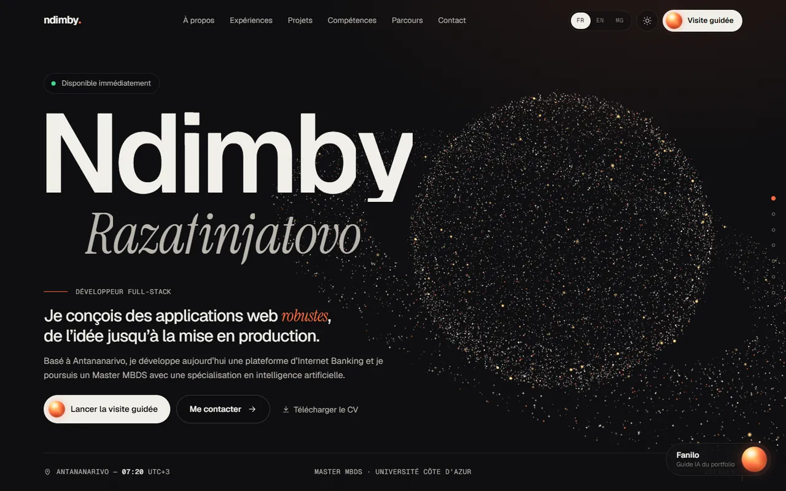
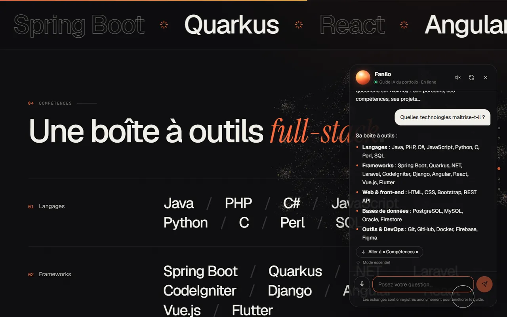
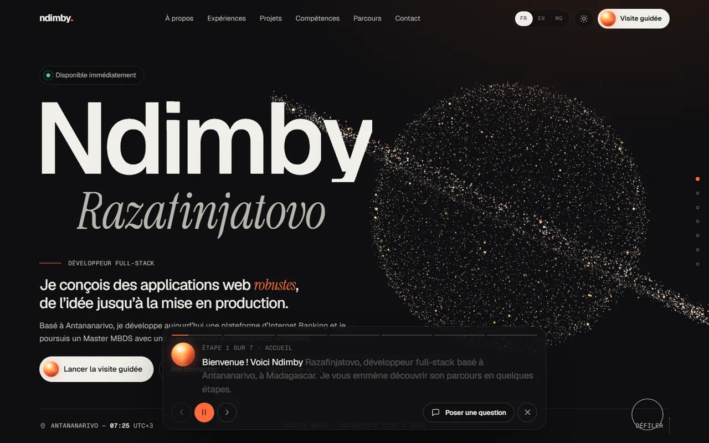
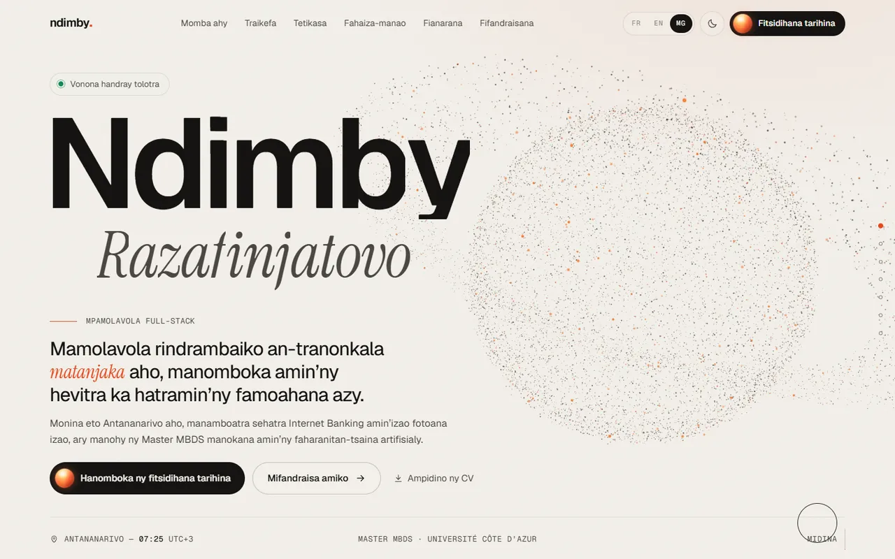
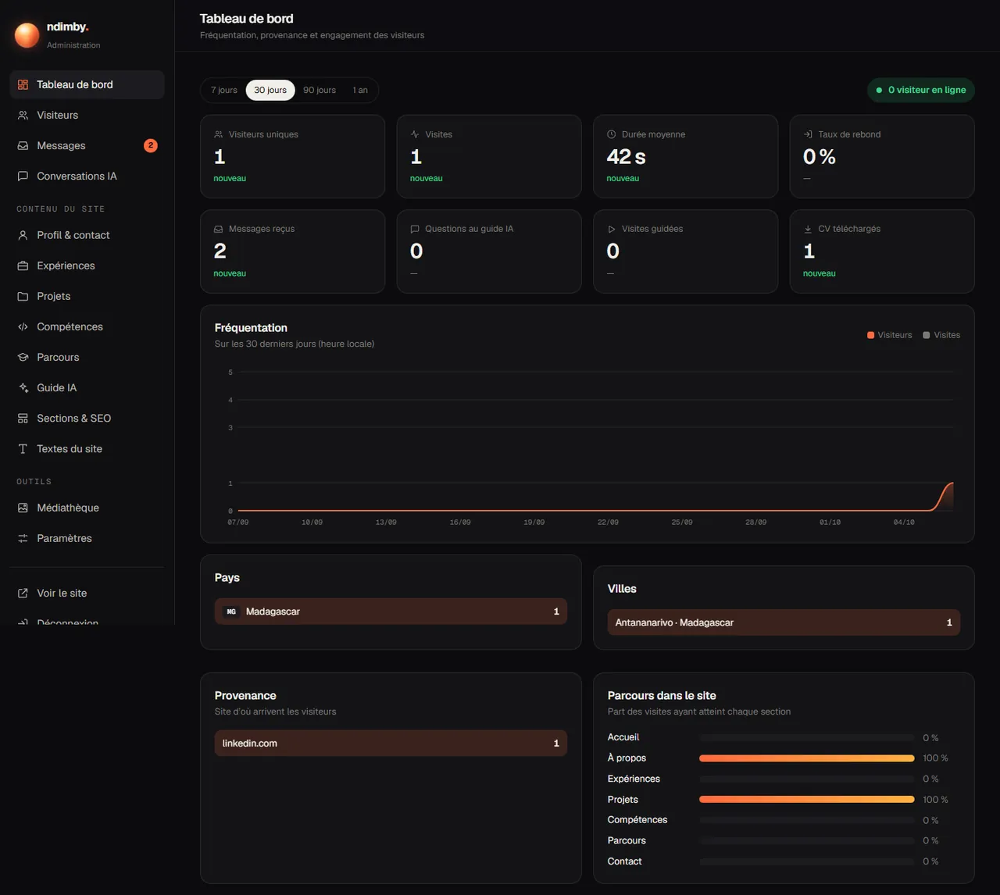
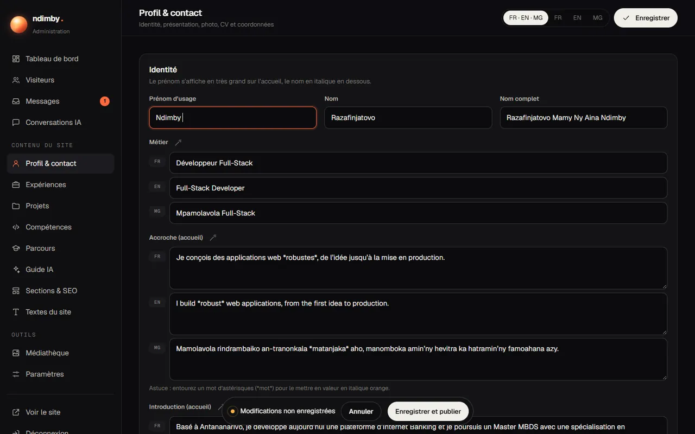

# Ndimby Razafinjatovo — Portfolio

Portfolio immersif d’un développeur full-stack basé à Antananarivo : univers 3D en particules, guide IA qui fait visiter le site et répond aux questions, site en **français, anglais et malagasy**, et interface d’administration complète (contenu, messages, statistiques de visite).

Hébergement **100 % gratuit** sur Cloudflare (Workers, D1, KV, Workers AI) — aucune carte bancaire nécessaire.



## Fonctionnalités

**Site public**

- Animation 3D en WebGL : ~15 000 particules qui se transforment au fil des sections — planète, carte de Madagascar (Antananarivo en point lumineux), hélice, relief, réseau neuronal, atome, portail.
- Trois langues (FR par défaut, EN, MG), thème sombre et clair, défilement fluide, apparitions animées.
- **Fanilo, le guide IA** : discussion en direct (réponses en streaming), lecture à voix haute, dictée au micro, navigation automatique vers les sections et ouverture des projets, **visite guidée** commentée et sous-titrée.
- Mode « essentiel » : si l’IA est indisponible, le guide répond quand même à partir du contenu du site.
- Formulaire de contact avec **pièce jointe** (5 Mo), anti-spam, envoi par e-mail.
- Téléchargement du CV, fiches projets détaillées (galerie, vidéos, liens), page 404, SEO dynamique (Open Graph, JSON-LD, sitemap).
- Léger : ~60 Ko de JavaScript compressé, moteur 3D écrit à la main (7 Ko), polices auto-hébergées.

**Administration (`/admin`)**

- Tableau de bord : visiteurs, visites, durée, rebond, pays, villes, provenance, appareils, heures, parcours dans le site, visiteurs en direct.
- Détail de chaque visite (sections vues, actions, conversation avec l’IA).
- Boîte de réception des messages (pièces jointes, réponse en un clic).
- Historique des conversations avec le guide IA.
- Édition de **tout le contenu** dans les trois langues, avec **traduction automatique** FR → EN/MG.
- Médiathèque (images optimisées automatiquement, vidéos, PDF), historique des versions et restauration, export/import JSON, changement de mot de passe.

| | |
|---|---|
|  |  |
|  |  |
|  |  |

## Technologies

| Partie | Choix |
|---|---|
| Site & admin | Preact + Signals, TypeScript, Vite, CSS sur mesure, Lenis |
| 3D | WebGL2 natif (shaders GLSL écrits à la main) |
| Serveur | Cloudflare Workers + Hono |
| Données | D1 (SQLite) pour le contenu, les visites et les messages ; KV pour les fichiers |
| IA | Workers AI (gratuit, Llama 4 Scout / Llama 3.3) ; Google Gemini ou Claude en option |
| E-mails | Resend (3 000 e-mails/mois gratuits) |

```
├── index.html, admin/index.html, 404.html   Pages
├── src/shared/        Types, contenu par défaut (CV), textes de l’interface FR/EN/MG
├── src/site/          Site public : sections, scène 3D (gl/), guide IA (guide/)
├── src/admin/         Interface d’administration
├── worker/            API : contenu, contact, chat IA, statistiques, fichiers, admin
├── migrations/        Schéma de la base D1
└── scripts/           Installation Cloudflare automatisée
```

## Démarrer en local

Prérequis : Node.js 20 ou plus.

```bash
npm install
cp .dev.vars.example .dev.vars         # puis choisissez un mot de passe admin
npm run db:migrate:local               # crée la base locale
npm run build
npm run dev                            # site : http://localhost:5173 · admin : /admin/
```

En local, l’IA de Cloudflare n’est disponible qu’après `npx wrangler login` ; sans connexion, le guide passe automatiquement en mode essentiel.

## Mise en ligne gratuite (Cloudflare)

1. Créez un compte gratuit sur [dash.cloudflare.com](https://dash.cloudflare.com/sign-up) (aucune carte bancaire).
2. Connectez votre terminal : `npx wrangler login`
3. Lancez l’installation automatique :

   ```bash
   npm run setup -- --cv "C:\chemin\vers\mon-cv.pdf"
   ```

   Le script crée la base de données et le stockage, applique le schéma, déploie le site, téléverse le CV et affiche **l’adresse du site** et **le mot de passe de l’administration** (à noter ; modifiable ensuite dans Paramètres).

Pour les mises à jour suivantes : `npm run deploy`.

### Recevoir les messages par e-mail (gratuit)

1. Créez un compte sur [resend.com](https://resend.com) **avec l’adresse qui doit recevoir les messages** (celle de `CONTACT_TO_EMAIL` dans `wrangler.jsonc`).
2. Créez une clé API, puis : `npx wrangler secret put RESEND_API_KEY`

Sans domaine personnel, Resend envoie depuis `onboarding@resend.dev` vers votre propre adresse, ce qui suffit pour être notifié. Les messages restent de toute façon consultables dans l’administration. Le bouton « Répondre » de l’e-mail répond directement au visiteur.

### Une IA encore meilleure (optionnel)

Le guide utilise par défaut **Workers AI**, gratuit (10 000 neurones par jour, soit quelques centaines de questions). Pour un malagasy plus naturel, ajoutez l’un de ces fournisseurs ; les autres restent en secours automatique :

| Fournisseur | Coût | Commande |
|---|---|---|
| Google Gemini | offre gratuite ([aistudio.google.com](https://aistudio.google.com/apikey)) | `npx wrangler secret put GEMINI_API_KEY` |
| Claude (Anthropic) | payant à l’usage ([console.anthropic.com](https://console.anthropic.com)) | `npx wrangler secret put ANTHROPIC_API_KEY` |

Les modèles se règlent avec les variables `GEMINI_MODEL` (défaut `gemini-flash-latest`), `CLAUDE_MODEL` (défaut `claude-opus-5-5` ; `claude-haiku-4-5` coûte nettement moins cher) et `WORKERS_AI_MODEL`. `AI_PROVIDER` force un fournisseur (`claude`, `gemini`, `workers-ai`, ou `local` pour désactiver l’IA). Avec Claude, les refus éventuels du modèle sont automatiquement relancés sur le modèle de secours recommandé par Anthropic.

### Déploiement automatique depuis GitHub

**Option simple (recommandée) :** dans le tableau de bord Cloudflare → *Workers & Pages* → `portfolio` → *Settings* → *Builds* → *Connect*, choisissez ce dépôt. Commande de build : `npm run build` ; commande de déploiement : `npx wrangler d1 migrations apply DB --remote && npx wrangler deploy`. Chaque `git push` met le site à jour.

**Option GitHub Actions :** ajoutez les secrets `CLOUDFLARE_API_TOKEN` (jeton « Edit Cloudflare Workers » avec accès D1) et `CLOUDFLARE_ACCOUNT_ID` au dépôt ; le workflow `.github/workflows/deploy.yml` déploiera à chaque push sur `main`.

### Nom de domaine personnalisé (optionnel)

Le site fonctionne sur `https://portfolio.<votre-sous-domaine>.workers.dev`. Pour un domaine à vous, ajoutez-le dans Cloudflare puis *Workers* → `portfolio` → *Settings* → *Domains & Routes*.

## Variables et secrets

| Nom | Type | Rôle |
|---|---|---|
| `ADMIN_PASSWORD` | secret | Mot de passe initial de `/admin` (remplaçable depuis l’admin) |
| `SESSION_SECRET` | secret | Signature des sessions et des liens de pièces jointes |
| `CONTACT_TO_EMAIL` | variable | Adresse qui reçoit les messages |
| `RESEND_API_KEY` | secret | Envoi des e-mails |
| `RESEND_FROM` | variable | Expéditeur (défaut `Portfolio <onboarding@resend.dev>`) |
| `GEMINI_API_KEY` / `ANTHROPIC_API_KEY` | secret | Fournisseurs d’IA facultatifs |
| `AI_PROVIDER` | variable | `auto` (défaut), `claude`, `gemini`, `workers-ai`, `local` |

## Limites du plan gratuit

100 000 requêtes par jour, 5 Go de base de données, 1 Go de fichiers, 10 000 neurones d’IA par jour : largement suffisant pour un portfolio. Si le quota d’IA est atteint, le guide bascule en mode essentiel jusqu’au lendemain.

## Vie privée et sécurité

- Statistiques sans cookie : identifiant aléatoire, adresse IP jamais stockée en clair (empreinte salée), robots et visites de l’administrateur exclus.
- Administration protégée par mot de passe (session signée, cookie `HttpOnly`/`SameSite=Strict`, limitation des tentatives, vérification de l’origine des requêtes).
- Pièces jointes privées (accessibles depuis l’admin ou via un lien signé de 30 jours dans l’e-mail).
- En-têtes de sécurité (CSP, `X-Frame-Options`…), formulaire protégé par un champ piège et une limitation par adresse.

---

Conçu et développé à Antananarivo, Madagascar.
